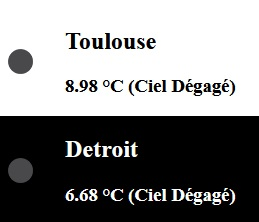

  

# API Météo
Toujours un travail sur les API 
Cette fois grâce au [tuto de Lior CHAMLA](https://www.youtube.com/watch?v=zrigq4HIecM&list=PLpUhHhXoxrjf-CGm82kXtbrAtoMsO5xsL) j'apprends à intégrer une API Météo.
